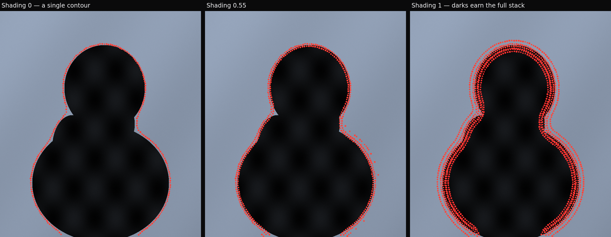
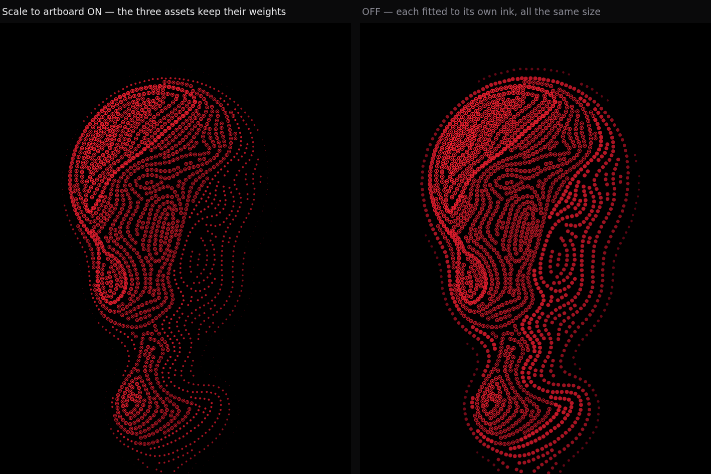
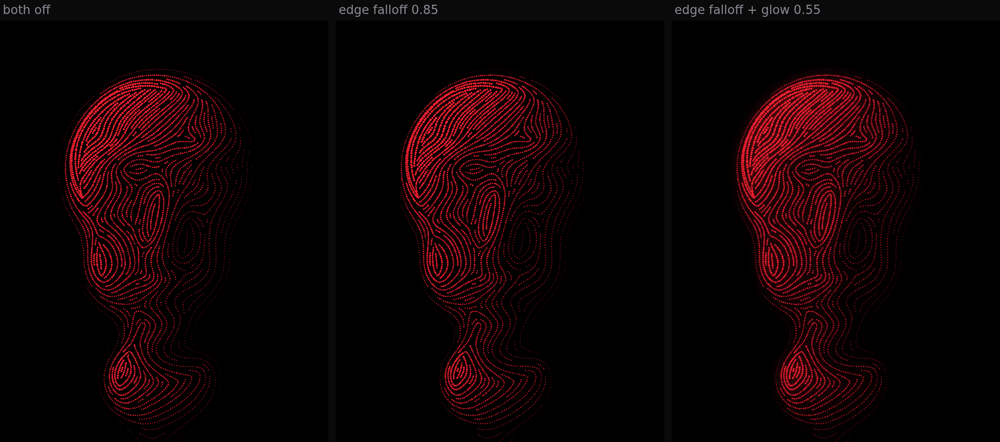

# Contour Dots

A standalone p5.js prototype that finds contours in a photograph and draws them
as fields of oriented dots, exported as fully editable SVG.

It has two renderers, chosen by the **Mode** switch at the top of the panel:

- **Edge** (the default) — identifies the boundary between subject and
  background and lays dots along it, over the photograph. Contours step away
  from that edge in parallel bands, and how many bands appear at any point is
  decided by how dark the picture is there: a single line through the light
  regions, thickening into shading in the darks.
- **Surface** — the original renderer: treats the image as a height map and
  fills the whole form with dots flowing along its iso-depth contours.


## Run it

```
open index.html
```

That is the whole setup. There is no build step and no package manager —
p5.js is vendored in `vendor/`, so the page works offline and straight off the
filesystem. To serve it instead:

```
npx http-server -p 8080 .
```

Drop an image anywhere on the canvas to load it. Drop an `.svg` to use its
outline as the dot shape.

It opens on a built-in sample so there is something to turn the knobs against
straight away. That sample is deliberately a *shaded render* rather than a
clean depth map — a surface lit from the upper left — because that is what a
real photograph looks like going in, and the pipeline has to recover depth
from luminance either way.

## The edge renderer

Everything here rests on one field: the **signed distance** to the silhouette,
positive inside the subject and negative out in the background.

```
sd(x, y) = distance to the subject/background boundary,  signed
```

Its zero level *is* the edge, and every other level is a clean parallel offset
from it. So "one contour" and "eight contours stepping outward" are the same
operation at different levels rather than two code paths, and the contours are
extracted exactly, by marching squares, rather than approximated.

### Shading



How many of those contours actually appear at a given place is decided by the
picture's own tonality. Dark regions earn the full stack of bands and read as
shading; light regions keep only band 0 and read as a single line tracing the
subject:

```
bands allowed here = 1 + (Number of lines - 1) x Shading x darkness ^ Shading falloff
```

Band 0 is always allowed, so the subject never loses its outline. At
**Shading** 0 every region keeps exactly one contour, whatever the tone.

Tonality is deliberately taken from the raw luminance and is never inverted.
**Invert depth** exists to say which side of the threshold is the subject,
which is a separate question from which parts of the picture are dark —
gating the shading on an inverted tone would put the banding in the
highlights.

### The silhouette

The subject is whatever falls on one side of **Threshold**, so that control is
doing the real work. Two things help:

- **Largest region only** (on by default) keeps a single subject. Without it,
  any background patch that happens to cross the threshold grows its own
  silhouette and the contours go wandering off across the sky.
- **Preview silhouette** tints what the threshold currently calls the subject.
  When the edge lands somewhere unexpected the question is always "what does
  the threshold actually think the subject is", and that is worth being able
  to see rather than infer.

A single global threshold is what it is: on a strongly graded background it
cannot separate subject from background at any setting, because some of the
background genuinely is darker than some of the subject. The preview makes
that visible immediately instead of leaving you turning knobs.

### The image underneath

The photograph is drawn under the dots — the contours identify the subject
rather than replacing it. **Show image** and **Image opacity** control that,
and **Embed image in SVG** writes the photograph into the export so the file
stands alone. Embedding roughly triples the file size for a typical render;
turn it off for a purely geometric SVG.

## The surface renderer

The image is not treated as brightness to be halftoned. It is treated as a
**height map**, and everything else is derived from it. There are two fields.

### Field 1 — depth

```
D(x, y)        black = far away,  white = close
```

Depth decides four things: where dots exist at all, how big each one is, how
densely they pack, and how the surface reads as form. Everything below the
threshold is negative space — genuine background, not a dark dot.

### Field 2 — flow

Flow is not authored separately. It is the gradient of depth, turned ninety
degrees so that it runs *along* the iso-depth contours rather than across them:

```
grad D = ( dD/dx ,  dD/dy )
F      = ( -dD/dy ,  dD/dx )
```

Streamlines of `F` are the contour lines, so they wrap around a cheek, a brow
or a knuckle for free. Every dot then takes its orientation from the field it
sits in:

```
rotation = atan2(flow.y, flow.x)
```

### Why the flow field is stored as a doubled angle

A contour direction is a **line**, not a vector: `theta` and `theta + PI` mean
the same thing. Averaging raw vectors would cancel them out at every sign flip
and shred the field. So the flow is carried as `(cos 2theta, sin 2theta)`,
which is flip-invariant, smoothed in that form, and halved back on sampling.
That is what lets direction diffuse into the flat, gradient-free regions of a
face instead of dissolving there — and it is why the lines stay continuous.

### Why the lines are evenly spaced

Streamlines are traced with the Jobard & Lefer method: trace a line, then seed
new lines at a fixed perpendicular offset from it, rejecting any seed that
falls too close to a line that already exists. The result is the even woven
banding of the reference, rather than the clumping and crossing you get from
seeding at random. Separation is depth-modulated, so near regions of the
surface carry more lines than far ones.

## The dot primitive

This is deliberately **not** a generic particle system. A dot is a small piece
of oriented geometry that turns as the surface bends, and every shape is stored
once as a path in a unit box:

```js
drawDot(ctx, x, y, size, rotation, type)
```

| `type`     | geometry                                   |
|------------|--------------------------------------------|
| `circle`   | rotationally symmetric; the fast path       |
| `square`   | turns with the contour                      |
| `diamond`  | turns with the contour                      |
| `line`     | a capsule — the most directional of the set |
| `custom`   | any uploaded SVG, normalised to the unit box |
| `tones`    | three uploaded SVGs, chosen per dot by depth |

Uploading an SVG collects its `path` / `circle` / `rect` / `ellipse` /
`polygon` / `polyline` / `line` elements and fits them into the unit box. The
canvas renderer and the SVG exporter consume that one definition, so what you
export is exactly what you saw.

A shape is kept as a **list of parts, each with its own paint** — not merged
into a single filled path. Merging loses exactly the information that makes a
shape a shape:

- A subpath meant to punch a hole, declared `fill-rule="evenodd"`, fills solid
  under the default `nonzero` rule. Rings, frames and letter counters all come
  in as blobs.
- Art defined by `stroke` with `fill="none"` has no fill to draw, so filling
  its outline turns a thin ring into a disc.

Each element's own `fill`, `stroke`, `stroke-width` and `fill-rule` are read
and honoured, inheriting from ancestor `<g>`s — icon sets routinely set
`fill="none" stroke="currentColor"` once on a wrapper rather than on every
child. In the export, stroked parts take their colour from `currentColor`,
which the enclosing colour group sets alongside `fill`, so one group still
drives every dot in a bucket.

### Tone-mapped shapes

`Tones` mode takes three uploaded SVGs — **Dark**, **Mid**, **Bright** — and
picks between them per dot, from the same depth value that already drives
size, density and colour. The primitive itself changes as the surface
recedes, so the *shape* carries tonality: a light mark in the dark, far
regions, a heavy one in the bright, near ones.



#### Prepare the three assets on one artboard

This is the part that decides whether it works. Export all three SVGs from a
**single, shared artboard**, and let each mark occupy as much of that artboard
as its tonal weight deserves — a small dot for the dark end, a large ring for
the bright end. The three files should differ *only* in how much of the
canvas they fill.

That is because the artboard is the sole thing relating one exported asset to
another. Fitting each shape to its own ink instead — cropping to the drawn
marks and blowing each up to fill the dot — renders a 9-unit dot and a
46-unit ring at exactly the same size, and the tonal difference between your
three assets is destroyed before anything is drawn. **Scale to artboard**, on
by default, is what preserves it; the comparison above is the same three
files with the toggle on and off. Turn it off for a lone shape that should
fill the dot regardless of the canvas it was drawn on.

Files with no `viewBox` and no `width`/`height` have no artboard to read, so
they always fall back to ink fitting.

#### Bands

Two sliders set the boundaries: **Dark → mid** and **Mid → bright**, in depth
units. They are independent, so they can be dragged past each other; that is
ordered internally rather than silently erasing the middle band.

Each slot shows a live count of the dots currently falling in its band, so an
empty band — or one that has swallowed the whole image — is visible rather
than something to infer from the render. Depth after thresholding tends to
skew bright, so expect to pull both splits up from their defaults.

You do not have to fill all three. An empty slot borrows from its nearest
filled neighbour, so a single upload already gives a usable result and you can
add the others as you go. The `Tones` button stays disabled until at least one
slot is filled.

#### Letting shape do the work

Dot size is depth-driven too, and by default that ramp compounds with the
shape ramp. To get closest to a classic halftone — where the mark alone
carries the tone — flatten the size ramp: **Size falloff** low, **Size
variation** 0. The three primitives then differ only in their own weight.

The single-shape `Custom` slot is unchanged and independent, and a dragged-and
-dropped SVG still goes to it — the three tone slots are only ever filled by
their own explicit buttons, so a drop can never land in one by surprise.

## Edge falloff and glow

Two optional finishing effects, both off by default.



**Edge falloff** shrinks dots as they approach the silhouette, *independently
of depth*. Depth alone cannot express this: a point can be near the camera and
still sit right on the rim of the form, and that is exactly where dots want to
disappear. Without it the artwork ends on a hard cut where the threshold bites;
with it the form dissolves into the negative space.

It needs a distance-to-silhouette field, which is computed once per depth
rebuild with an exact Euclidean distance transform (Felzenszwalb &
Huttenlocher) — linear time, and exact rather than the usual chamfer
approximation, because the distance drives dot size directly and a chamfer's
octagonal bias would show as visible faceting along a curved silhouette. Both
edge controls are then a cheap remap of that field, so they re-render at dot
speed rather than triggering a full rebuild.

**Glow** is a blurred copy of the dot layer laid underneath the crisp one. It
carries no depth term of its own and does not need one: the dots are already
coloured by depth, so blurring that layer blooms hardest where the surface is
nearest and brightest. Near-side weighting falls out of the colour ramp for
free.

Compositing is plain source-over rather than additive, so the canvas and the
SVG `<filter>` agree exactly. On a dark ground the two are visually
indistinguishable, and matching the export is worth more than the marginally
punchier additive blend.

## SVG export

`Export SVG` writes real vector geometry, not a traced bitmap:

- Each shape used is emitted **once** into `<defs>`, and each dot is a `<use>`
  carrying its own `translate / rotate / scale`. Swapping one definition
  restyles every dot that references it. In tone mode that means three
  definitions, and only the ones actually placed are written.
- Circles take a shorter path — a plain `<circle>` — which is smaller and
  friendlier to downstream tools.
- Dots are grouped into colour buckets as `<g fill>` groups rather than
  carrying a fill attribute each.
- In Edge mode the photograph is embedded as a JPEG data URI in an `<image>`
  under the dots, so the file stands alone.
- With the glow on, the dot layer goes into `<defs>` once and is drawn twice
  with `<use>` — blurred underneath, crisp on top. Emitting the dots twice
  would double the file for nothing; as it is, the glow costs about 0.1%.
  Note that the glow is an SVG filter, and some editors rasterise filters on
  import. Set Glow to 0 before exporting if you need a purely geometric file.

Every dot arrives in Illustrator or Figma as an individual editable object.
Export fidelity for the vector layer is verified against the canvas: 99.4–99.8% pixel overlap
across all shape types, the remainder being antialiasing on dot edges. With
the glow on, that binary measure is the wrong instrument — a soft halo puts
many pixels right at the threshold — so parity there is measured as mean
absolute luminance error, which comes out at 0.43/255, with 0.03% of pixels
differing by more than 8/255. That is marginally *better* than the no-glow
baseline.

`Export PNG` writes the canvas as-is.

## Controls

**Render** — Mode: Edge or Surface. Controls that belong to one renderer are
hidden in the other.

**Image** — Threshold (defines the silhouette in Edge mode; carves the
negative space in Surface mode), Contrast, Invert depth, Largest region only,
Preview silhouette, Show image, Image opacity, Embed image in SVG.

**Contours (Edge)** — Number of lines, Spread (which side of the edge the
extra contours step towards), Shading, Shading falloff, Line spacing.

**Depth (Surface)** — Depth exaggeration (displaces each dot along the depth gradient;
this is the relief that makes the bands bulge towards the viewer rather than
read as a flat contour map), Depth contrast, Depth smoothing (turns a noisy
photograph into a continuous surface — contours need this).

**Contours (Surface)** — Line density, Flow strength (0 = straight lines at
the base angle, 1 = pure depth contours), Flow distortion, Base angle, Flow
coherence.

**Dots** — Shape, Scale to artboard, Dark → mid, Mid → bright, Dot size,
Size variation, Size by tone, Size falloff, Dot spacing, Randomness, and
(Surface only) Edge falloff and Edge width.

**Size by tone** defaults to 0, an even mark — which is what an overlay wants,
and what the reference sets are. Raise it towards 1 for the Surface renderer,
where dots shrinking as the form recedes is most of the effect.

**Glow** — Glow, Glow radius.

**Colour** — Background, Far colour, Near colour, Colour falloff.

Edge falloff and Glow both default to 0, i.e. off. Nothing about the base
render changes until you ask for it.

Dot spacing is floored at a little over one dot diameter, so the largest,
densest dots cannot fuse into a solid line and collapse the halftone into fill.

## Getting a good result from a photograph

The pipeline reads luminance as depth, so it rewards images that are already
lit like a depth map: a single strong light, a dark background, and the subject
falling off into shadow at its edges. Studio portraits and product shots on
black work best.

- Start with **Depth smoothing** — raise it until the contours stop breaking
  into small closed loops and start reading as bands.
- Then set **Threshold** so the background is fully black and the subject's
  silhouette is where you want it.
- **Flow strength** below about 0.5 is where the piece stops being a contour
  map and starts being a striped halftone; both are useful.
- If the subject is dark against a light ground, turn on **Invert depth**
  first — nothing else will behave until the near/far sense is right.
- In Edge mode, turn on **Preview silhouette** before anything else and set
  **Threshold** until the tinted region is the subject. Every contour is an
  offset of that boundary, so nothing downstream can be right until it is.
- **Edge falloff** is worth reaching for whenever the silhouette reads as cut
  out rather than lit; set **Edge width** to roughly the width of the falloff
  you want in pixels.
- **Glow** wants to stay under about 0.5. Past that it stops reading as bloom
  and starts washing out the negative space, which is the one thing holding
  the image together.

Where a photograph's brightness genuinely disagrees with its geometry — a dark
iris on a lit face, a specular highlight in a crease — the contours will follow
the brightness, because brightness is the only depth signal available. Feeding
the tool an actual depth map (from a phone's portrait-mode depth channel, or a
monocular depth estimator) sidesteps that entirely, and the controls behave the
same way.

## Performance

The pipeline is staged, and each control dirties only its own stage and
everything downstream of it:

```
depth  ->  flow  ->  lines  ->  dots  ->  draw
```

Moving a dot slider never re-traces the contours; changing a colour only
redraws. While a slider is moving, a reduced-quality draft renders at ~50 ms
and a full-quality pass follows once you stop. Analysis runs on a 420 px grid
regardless of source resolution. Typical full render is 40–200 ms; the densest
possible settings (~100k dots) take about 3 s.

## Files

```
index.html            markup + script order
css/style.css         tool chrome
js/core.js            Field container (bilinear sampling, separable blur),
                      exact Euclidean distance transform, signed distance,
                      connected-region isolation, math
js/field.js           depth field, tonality, silhouette mask, gradient, flow
js/streamlines.js     evenly-spaced streamline tracer + spatial hash (Surface)
js/isolines.js        marching squares: iso-contours as linked polylines
js/edge.js            signed-distance bands and the tone gate (Edge)
js/shapes.js          the dot primitive, drawDot, SVG shape upload
js/dots.js            streamlines -> oriented dots, edge falloff, colour ramp
js/svgexport.js       vector export
js/ui.js              declarative control schema + panel
js/app.js             p5 sketch, pipeline orchestration, I/O
vendor/p5.min.js      p5.js 1.9.4
```
