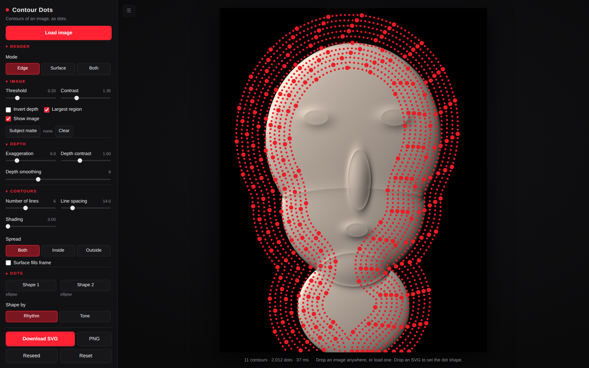

# Contour Dots

A standalone p5.js prototype that turns a photograph into a field of oriented
dots flowing along the contours of its implied 3D form, and exports the result
as a fully editable SVG.



## Run it

```
open index.html
```

That is the whole setup. There is no build step and no package manager —
p5.js is vendored in `vendor/`, so the page works offline and straight off the
filesystem. To serve it instead:

```
npx http-server -p 8080 .
```

Serving is required for one optional feature: **Estimate depth** loads a depth
model over the network, and browsers refuse module imports on `file://`. Every
other control works offline exactly as before.

Drop an image anywhere on the canvas to load it. Drop an `.svg` to use its
outline as the dot shape.

It opens on a built-in sample so there is something to turn the knobs against
straight away. That sample is deliberately a *shaded render* rather than a
clean depth map — a surface lit from the upper left — because that is what a
real photograph looks like going in, and the pipeline has to recover depth
from luminance either way.

## The idea

The image is not treated as brightness to be halftoned. It is treated as a
**height map**, and everything else is derived from it. There are two fields.

### Field 1 — depth

```
D(x, y)        black = far away,  white = close
```

Depth decides four things: where dots exist at all, how big each one is, how
densely they pack, and how the surface reads as form. Everything below the
threshold is negative space — genuine background, not a dark dot.

### Field 2 — flow

Flow is not authored separately. It is the gradient of depth, turned ninety
degrees so that it runs *along* the iso-depth contours rather than across them:

```
grad D = ( dD/dx ,  dD/dy )
F      = ( -dD/dy ,  dD/dx )
```

Streamlines of `F` are the contour lines, so they wrap around a cheek, a brow
or a knuckle for free. Every dot then takes its orientation from the field it
sits in:

```
rotation = atan2(flow.y, flow.x)
```

### Where depth comes from

Two sources, interchangeable downstream — the gradient, the flow field, the
streamlines and the dots only ever see the finished depth field, so every
control below means the same thing either way.

**Luminance** is the default and needs nothing: it reads the image's own
brightness as height. It costs nothing and works offline, but it is a proxy.
Where a photograph's tones disagree with its geometry — a dark iris on a lit
face, a specular highlight sitting in a crease — the contours follow the tones
and the form goes wrong.

**Estimate depth** replaces that guess with
[Depth Anything V2 (small)](https://huggingface.co/onnx-community/depth-anything-v2-small),
run in the browser through transformers.js — WebGPU where the browser has it,
WebAssembly otherwise. It substitutes for exactly one step, the luminance read
at the top of `buildDepth`, and nothing else in the pipeline changes.

The model outputs *inverse* depth, so larger already means nearer, which is the
convention the field wants. The float tensor is used rather than the 8-bit
preview image the pipeline also returns: the flow field differentiates this
map, and 8-bit quantisation shows up as banding in the gradient.

It is lazy and cached. Nothing is fetched until the control is switched on; the
estimate is then held against that image, so toggling it off and back on is
free and no slider ever waits on the model. The first run downloads weights
(~25 MB quantised on WebAssembly, ~100 MB fp32 on WebGPU) and the browser
caches them; inference is roughly 100–600 ms after that. If the model or the
library cannot be reached, the tool says why, switches the control back off and
carries on with luminance rather than rendering a broken field silently.

**Show depth map** draws field 1 behind the dots, which is the quickest way to
see what the contours are actually following. It is a viewing aid — the SVG
export carries the dots, not the underlay.

To pin a different library build or model, set `window.CD_TRANSFORMERS_URL` or
`window.CD_DEPTH_MODEL` before `js/depthmodel.js` loads.

### Why the flow field is stored as a doubled angle

A contour direction is a **line**, not a vector: `theta` and `theta + PI` mean
the same thing. Averaging raw vectors would cancel them out at every sign flip
and shred the field. So the flow is carried as `(cos 2theta, sin 2theta)`,
which is flip-invariant, smoothed in that form, and halved back on sampling.
That is what lets direction diffuse into the flat, gradient-free regions of a
face instead of dissolving there — and it is why the lines stay continuous.

### Why the lines are evenly spaced

Streamlines are traced with the Jobard & Lefer method: trace a line, then seed
new lines at a fixed perpendicular offset from it, rejecting any seed that
falls too close to a line that already exists. The result is the even woven
banding of the reference, rather than the clumping and crossing you get from
seeding at random. Separation is depth-modulated, so near regions of the
surface carry more lines than far ones.

## The dot primitive

This is deliberately **not** a generic particle system. A dot is a small piece
of oriented geometry that turns as the surface bends, and every shape is stored
once as a path in a unit box:

```js
drawDot(ctx, x, y, size, rotation, type)
```

| `type`     | geometry                                   |
|------------|--------------------------------------------|
| `circle`   | rotationally symmetric; the fast path       |
| `square`   | turns with the contour                      |
| `diamond`  | turns with the contour                      |
| `line`     | a capsule — the most directional of the set |
| `custom`   | any uploaded SVG, normalised to the unit box |

Uploading an SVG flattens its `path` / `circle` / `rect` / `ellipse` /
`polygon` / `polyline` / `line` elements into a single path, measures it with
`getBBox()`, and fits it into the same unit box preserving aspect ratio. The
canvas renderer and the SVG exporter consume that one definition, so what you
export is exactly what you saw.

## SVG export

`Export SVG` writes real vector geometry, not a traced bitmap:

- The shape is emitted **once** into `<defs>`, and each dot is a `<use>`
  carrying its own `translate / rotate / scale`. Swapping that single
  definition restyles every dot in the file at once.
- Circles take a shorter path — a plain `<circle>` — which is smaller and
  friendlier to downstream tools.
- Dots are grouped into colour buckets as `<g fill>` groups rather than
  carrying a fill attribute each.

Every dot arrives in Illustrator or Figma as an individual editable object.
Export fidelity is verified against the canvas at 99.3–99.8% pixel overlap
across all shape types; the remainder is antialiasing on dot edges.

`Export PNG` writes the canvas as-is.

## Controls

**Depth source** — Estimate depth (Depth Anything V2 instead of luminance),
Show depth map (field 1 as a greyscale underlay).

**Image** — Threshold (carves the negative space), Contrast, Invert depth
(for a subject lit dark-on-light).

**Depth** — Depth exaggeration (displaces each dot along the depth gradient;
this is the relief that makes the bands bulge towards the viewer rather than
read as a flat contour map), Depth contrast, Depth smoothing (turns a noisy
photograph into a continuous surface — contours need this).

**Contours** — Line density, Line spacing, Flow strength (0 = straight lines
at the base angle, 1 = pure depth contours), Flow distortion, Base angle,
Flow coherence.

**Dots** — Shape, Dot size, Size variation, Size falloff, Dot spacing,
Randomness.

**Colour** — Background, Far colour, Near colour, Colour falloff.

Dot spacing is floored at a little over one dot diameter, so the largest,
densest dots cannot fuse into a solid line and collapse the halftone into fill.

## Getting a good result from a photograph

The pipeline reads luminance as depth, so it rewards images that are already
lit like a depth map: a single strong light, a dark background, and the subject
falling off into shadow at its edges. Studio portraits and product shots on
black work best.

- Start with **Depth smoothing** — raise it until the contours stop breaking
  into small closed loops and start reading as bands.
- Then set **Threshold** so the background is fully black and the subject's
  silhouette is where you want it.
- **Flow strength** below about 0.5 is where the piece stops being a contour
  map and starts being a striped halftone; both are useful.
- If the subject is dark against a light ground, turn on **Invert depth**
  first — nothing else will behave until the near/far sense is right.

Where a photograph's brightness genuinely disagrees with its geometry — a dark
iris on a lit face, a specular highlight in a crease — luminance depth will
follow the brightness, because brightness is then the only depth signal
available. Turn on **Estimate depth** and that stops being true: the model
reads the geometry instead, and the controls behave the same way. Expect to
drop **Depth smoothing** a long way afterwards — an estimated map arrives
already continuous, and the smoothing that rescues a noisy photograph will
flatten real form out of it.

## Performance

The pipeline is staged, and each control dirties only its own stage and
everything downstream of it:

```
depth  ->  flow  ->  lines  ->  dots  ->  draw
```

Moving a dot slider never re-traces the contours; changing a colour only
redraws. Depth estimation sits upstream of the whole chain and runs once per
image, so it never enters this budget. While a slider is moving, a reduced-quality draft renders at ~50 ms
and a full-quality pass follows once you stop. Analysis runs on a 420 px grid
regardless of source resolution. Typical full render is 40–200 ms; the densest
possible settings (~100k dots) take about 3 s.

## Files

```
index.html            markup + script order
css/style.css         tool chrome
js/core.js            Field container (bilinear sampling, separable blur), resample, math
js/field.js           depth field, gradient, flow field
js/streamlines.js     evenly-spaced streamline tracer + spatial hash
js/shapes.js          the dot primitive, drawDot, SVG shape upload
js/dots.js            streamlines -> oriented dots, colour ramp
js/svgexport.js       vector export
js/depthmodel.js      Depth Anything V2 in the browser (transformers.js)
js/ui.js              declarative control schema + panel
js/app.js             p5 sketch, pipeline orchestration, I/O
vendor/p5.min.js      p5.js 1.9.4
```
