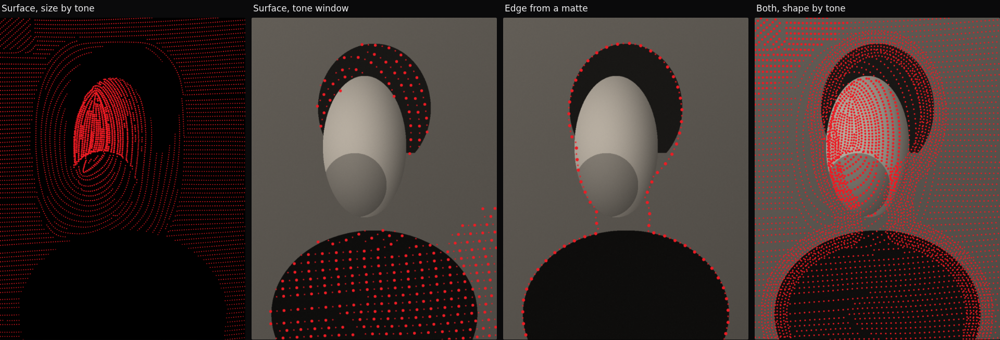
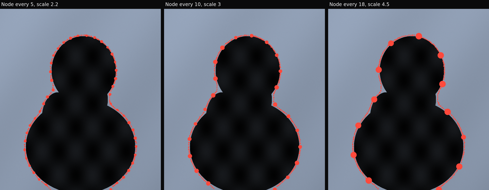

# Contour Dots

A standalone p5.js prototype that finds contours in a photograph and draws them
as fields of oriented dots, exported as fully editable SVG.




This build is a pared-back combination of three earlier branches. It keeps the
two renderers, the two-slot SVG dot shapes and the node/link rhythm, and pins
everything else to the value that works — the panel is short enough to read at
a glance and the download buttons sit below it rather than at the end of a
scroll.

## Run it

```
open index.html
```

That is the whole setup. No build step, no package manager: p5.js is vendored,
so the page works offline and straight off the filesystem. To serve it instead,
`npx http-server -p 8080 .`

Drop an image anywhere on the canvas to load it. Drop an `.svg` to fill the
first empty shape slot.

## Choosing what happens where

Three things decide whether a dot exists and what it looks like, and they are
independent — most of the range comes from combining them rather than from any
one of them.

**Which lines get generated** — the **Mode**. *Edge* traces the silhouette,
*Surface* fills the form with flow lines, *Both* does each and draws them
together. Surface lines normally stop at the silhouette; **Surface fills
frame** runs them across the whole picture instead.

**Which dots survive** — the **tone window**. `Tone from` / `Tone to` keep dots
only where the picture's own tonality falls inside the window. Narrow it to the
shadows and marks appear on the hair and the shirt and nowhere else; leave it
open and they cover everything. This is what carves negative space in a
full-bleed halftone, and it applies to both kinds of line.

**What each dot looks like** — **Size by tone** ramps the dot against tonality,
positive towards the lights (the halftone reading) or negative towards the
darks. **Shape by** picks between the two uploaded shapes either by *Rhythm*
(shape 1 every Nth step) or by *Tone* (shape 1 in the darks, shape 2 in the
lights).

## The two renderers

**Edge** (the default) identifies the boundary between subject and background
and lays dots along it, over the photograph. Everything rests on the **signed
distance** to that silhouette — positive inside the subject, negative out in
the background. Its zero level *is* the edge, and every other level is a clean
parallel offset, so "one contour" and "eight stepping outward" are the same
operation at different levels. Contours are extracted exactly, by marching
squares.

**Surface** treats the image as a height map and fills the whole form with dots
flowing along its iso-depth contours. Flow is the depth gradient turned ninety
degrees, `F = (-dD/dy, dD/dx)`, so streamlines of `F` wrap around the form; it
is carried as a doubled angle so that smoothing averages *lines* rather than
vectors and direction diffuses into flat regions instead of cancelling out.

Controls that belong to one renderer are hidden in the other.

## Shading

How many contours appear at a given place is decided by the picture's own
tonality:

```
bands here = 1 + Number of lines x (1 - Shading + Shading x darkness ^ falloff)
```

Shading is how much tonality *thins* the stack, not whether there is one. At
**0** every band is drawn everywhere, so the contours are pure geometric
offsets of the silhouette with no tonal opinion — which is what you want when
the point is object against background. At **1** the darks keep the full stack
and the lights fall back to the outline alone. How many contours there are is
**Number of lines**; Shading only says how much the picture takes away.

Tonality is taken from the raw luminance and is never inverted: **Invert
depth** says which side of the threshold is the subject, which is a separate
question from which parts of the picture are dark.

## Finding the subject

**A luminance threshold selects a band of brightness, not an object.** On a
portrait the subject spans the whole range — dark hair, lit face, dark shirt —
while the background sits in the middle of it, so no threshold encloses the
person. Measured on exactly that image, every setting from 0.15 to 0.5 selected
the lit face and excluded the hair, the shirt and the wall alike. If the edge
contours look like they track the dark regions rather than the subject, this is
why, and no amount of tuning fixes it.

**Load a subject matte** and the question goes away: a cut-out PNG with alpha,
or a black-and-white matte, replaces the threshold as the definition of
"subject". With one loaded, the same portrait puts hair, face and shirt inside
the mask and the wall outside — true object/background separation, because you
said where the subject was rather than asking the tool to infer it. **Matte
cut** sets the level and **Invert matte** flips it; both appear only once a
matte is loaded.

The threshold remains the automatic path, and it is fine whenever the subject
really does sit on one side of a brightness cut. **Largest region** still keeps
a single subject and fills enclosed holes, whichever way the mask was made.

## The dot primitive

A dot is not a particle: it is a small piece of oriented geometry that turns as
the line bends. Rotation follows the contour's own tangent.

There are exactly **two shape slots**, and they are the node/link pair:



- **Shape 1** is the *node* — it lands every Nth step along the line.
- **Shape 2** is the *link* — it fills the run between two nodes.

Either falls back to a plain **ellipse** until an SVG is loaded into it, so the
tool works before any upload. **Node every** sets the interval and **Node
scale** how much bigger a node is than a link. At **Node every** 1 every dot is
shape 1, which is how you get a single uniform mark.

Each line starts on a node rather than a random phase, which also terminates an
open contour with one instead of cutting off mid-run. Links are suppressed
within about a node radius of the node just placed, so a node reads as a marked
point rather than a blob with dots buried in its edge.

### How an uploaded SVG is read

A shape is kept as a **list of parts, each with its own paint** — not merged
into one filled path. Merging loses exactly what makes a shape a shape: a
subpath declared `fill-rule="evenodd"` to punch a hole fills solid under the
default rule, and art defined by `stroke` with `fill="none"` turns a thin ring
into a disc. Each element's `fill`, `stroke`, `stroke-width` and `fill-rule`
are read and honoured, inheriting from ancestor `<g>`s.

Shapes are sized by their **artboard** (`viewBox`, else `width`/`height`), not
by their ink. The artboard is the only thing relating one exported asset to
another: fitting each to its own ink renders a small dot and a large ring at
identical size. If your two shapes already carry their relative size on a
shared artboard, set **Node scale** to 1, or the difference is counted twice.

## Controls

**Render** — Mode: Edge, Surface or Both.

**Image** — Threshold, Contrast, Invert depth, Largest region, Show image,
Subject matte, Matte cut, Invert matte.

**Depth** — Exaggeration (displaces each dot along the depth gradient), Depth
contrast. Both do real work in either renderer: depth contrast feeds the
threshold that defines the silhouette, and the exaggeration displaces dots
wherever they were placed.

**Contours** — Edge: Number of lines, Line spacing, Shading, Shading falloff,
Spread. Surface: Line spacing, Line density, Flow distortion, Flow coherence,
Surface fills frame.

**Dots** — Shape 1, Shape 2, Shape by, Shape split *or* Node every and Node
scale, Dot size, Size variation, Size by tone, Tone from, Tone to, Dot spacing.

Sections collapse: click a group heading. A control that cannot affect anything
in the current state is hidden rather than disabled — the matte cut appears only
with a matte loaded, Shape split only when shaping by tone, Spread only with
more than one line.

### Held constant

These were controls in earlier branches and are pinned here:

| | |
|---|---|
| Depth smoothing | 0 — **Flow coherence** does this job instead |
| Flow strength | 1 — pure depth contours |
| Randomness, Edge falloff | 0 |
| Image opacity | 1 |
| Dot colour | `#ed1c24` |
| Background | black |

Glow, the colour ramp, the three-band tone shapes, the single Custom slot and
the built-in square/diamond/line primitives are gone entirely.

**Depth smoothing at 0 has a consequence worth knowing.** It exists to make the
depth field continuous, and without it a noisy photograph gives a ragged
silhouette. Two things carry the load instead: **Largest region** keeps a
single subject *and* fills background regions that do not reach the border —
without that, any interior shadow dipping past the threshold punches a hole and
every hole grows its own contours. The silhouette is also feathered before it
is traced, which is not depth smoothing (the depth field is untouched) but
stops marching squares following a stair-stepped edge. In Surface mode, **Flow
coherence** is now the only smoothing in the pipeline, so it wants to be high:
measured on a portrait, raising it from 6 to 22 took the mean turn per step of
a streamline from 2.29 degrees to 0.64 — the difference between fingerprint
swirls in a flat wall and the long flowing bands of a halftone. It defaults
to 14.

## Export

**Download SVG** writes real vector geometry, not a traced bitmap. Each shape
used is emitted once into `<defs>` and every dot is a `<use>` carrying its own
transform, so the file stays small and every dot arrives in Illustrator or
Figma as an individual editable object. The built-in ellipse takes a shorter
path — a plain `<circle>`.

**What is on the canvas is what gets written.** The photograph is embedded as a
JPEG data URI when **Show image** is on, and omitted when it is off — 127KB
against 58KB on the default render.

Export fidelity is verified against the canvas as mean absolute luminance
error: 0.01/255 without the image, 0.29–0.31/255 with it, the difference being
JPEG compression of the embedded photograph rather than anything about the
vectors.

**PNG** writes the canvas as-is.

## Getting a good result

The pipeline reads luminance, so it rewards images that are already lit like a
depth map: a single strong light, a clean background, the subject falling off
at its edges.

- **Threshold** is doing the real segmentation work. Set it first; every
  contour is an offset of the boundary it defines, so nothing downstream can be
  right until it is.
- If the subject is dark against a light ground, turn on **Invert depth**
  before anything else.
- A single global threshold has a hard limit: on a strongly graded background
  it cannot separate subject from background at any setting, because some of
  the background genuinely is darker than some of the subject.
- For a full-bleed halftone: Surface, **Surface fills frame** on, **Size by
  tone** near 1, **Flow coherence** high, and the tone window set to cut the
  shadows to black.
- Keep **Line spacing** above the node diameter (`Dot size x Node scale x 2`),
  or adjacent bands collide.

## Performance

The pipeline is staged, and each control dirties only its own stage and
everything downstream:

```
depth  ->  flow  ->  lines  ->  dots  ->  draw
```

Moving a dot slider never re-traces the contours. While a slider is moving a
reduced-quality draft renders, and a full pass follows once you stop. Analysis
runs on a 420px grid regardless of source resolution. Typical render is
30–90 ms.

## Files

```
index.html            markup + script order
css/style.css         tool chrome
js/core.js            Field container, exact Euclidean distance transform,
                      signed distance, region isolation and hole filling
js/field.js           depth field, tonality, silhouette mask, gradient, flow
js/isolines.js        marching squares: iso-contours as linked polylines
js/edge.js            signed-distance bands and the tone gate (Edge)
js/streamlines.js     evenly-spaced streamline tracer (Surface)
js/shapes.js          the dot primitive, drawDot, SVG shape upload
js/dots.js            lines -> oriented dots, node/link rhythm
js/svgexport.js       vector export
js/ui.js              declarative control schema + panel
js/app.js             p5 sketch, pipeline orchestration, I/O
vendor/p5.min.js      p5.js 1.9.4
```
